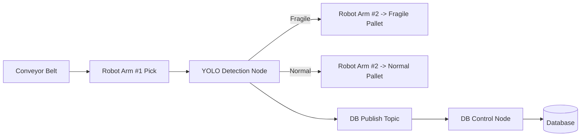

# Rokey6-A1-Isaac-simulation-project

## 📦 프로젝트 소개

Isaac Sim 5.0.0과 ROS2를 활용하여 물류 자동화 공정 환경을 구성하고,
시뮬레이션 기반 Digital Twin을 구현하는 프로젝트입니다.

가상 환경에서의 물류 공정 퍼포먼스를 분석하고,
실제 공장 데이터와 비교하여 병목 구간을 파악하고 최적화를 수행하는 것을 목표로 합니다.

## 🎯 프로젝트 목표

- 물류 자동화 공정의 Digital Twin 구현

- 시뮬레이션 기반 최적화 실험 환경 구축

- 실제 공정 대비 성능 차이 분석

- 병목 현상 감소 및 효율 향상

---

## 1. 시스템 설계

### 전체 시스템 아키텍처

## 🚀 2. 주요 기능 (Main Features)

- Isaac Sim 기반 물류 자동화 환경 구축

- ROS2 연동을 통한 로봇 제어 및 토픽 통신

-  AGV/Manipulator 기반 이송 시뮬레이션

-  센서 데이터 (카메라, LiDAR 등) 가상 생성

-  공정 흐름 자동화 시뮬레이션

-  공정 시간 분석 및 퍼포먼스 비교

-  Digital Twin 기반 최적화 실험 환경 제공

## 💻 3. 운영체제 환경 (Environment)

- OS: Ubuntu 22.04 LTS

## 🛠 4. 사용 장비 목록
### 💻 Hardware

- NVIDIA GPU RTX 5080 이상

- 32GB RAM 이상

### 🧩 Software

- ROS2: Humble

- Simulator: Isaac Sim 5.0.0

- Python version: 3.10

- AI detection : Yolov8

## 📦 5. requirements.txt

### requirement 설치 방법:

   `pip install -r requirements.txt`

## 6. 실행 순서 (Launch 순서 및 스크립트)
### 1️⃣ ROS2 환경 설정 및 워크 스페이스로 이동
   `source /opt/ros/humble/setup.bash`

   `source ~/warehouse/install/setup.bash`

### 2️⃣ ROS2 패키지 빌드 (패키지 이름 : warehouse)
   `cd ~/warehouse`
   `colcon build`
   `source install/setup.bash`

### 3️⃣ Isaac Sim 실행
   `./isaac-sim.sh`

### 4️⃣ Isaac Sim 에서 프로젝트 환경 불러오기
   Robotics Example > `load_conveyer` 불러오기

### 5️⃣프로젝트 노드 실행시키기
   `ros2 run warehouse detection_node`
   `ros2 run warehouse controller`

### (Optional) Nav2 런치 파일 실행
   `ros2 launch iw_navigation iw_navigation.launch.py`

## 📌 향후 발전 방향

- 강화학습 기반 Conveyor 속도 자동 조정

- 실시간 공장 IoT 데이터 연동
  
- Cloud DB 연동

- AI 기반 공정 예측 모델

- 다중 AGV 협업 알고리즘 적용
  
---

## 팀원 소개

<table><tr>
   <td align="center"><a href="https://github.com/sinya3558">
    <b>Seunga Kim</b> </a> </td>
   <td align="center"><a href="https://github.com/dozi-del">
    <b>Doyoung Kim</b> </a> </td>
   <td align="center"><a href="https://github.com/G0RaNii">
    <b>Gyuhyeok Moon</b> </a> </td>
   <td align="center"><a href="https://github.com/donghyun0313">
    <b>Donghyun Park</b> </a> </td>
</tr></table>
